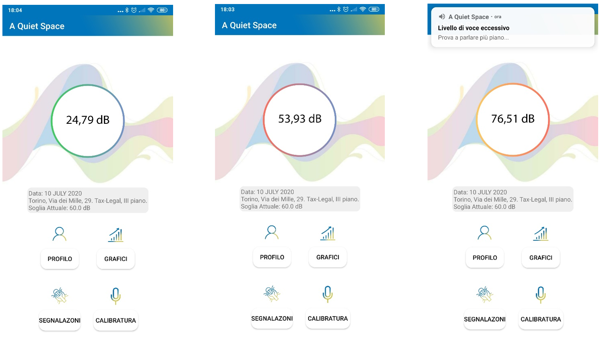

# OpenNoise

## Introduzione
**OpenNoise** è un sistema IoT progettato per monitorare i livelli di rumorosità negli uffici open space, fornendo feedback visivi e sonori agli utenti per mantenere un ambiente di lavoro più tranquillo. Il progetto combina l'utilizzo di hardware basato su Arduino, un'applicazione Android e servizi cloud per la raccolta, elaborazione e visualizzazione dei dati.

## Architettura del Sistema
Il sistema si basa su due architetture principali:

1. **Architettura distribuita**:
   - Un microfono remoto basato su Arduino, connesso al cloud tramite Node-RED e ThingSpeak.
   - Un'applicazione Android che visualizza i dati raccolti e fornisce notifiche agli utenti.

   

2. **Architettura integrata** (futura implementazione):
   - Un software o servizio web che utilizza il microfono del PC per raccogliere i dati.

   

### Componenti hardware
- **Scheda Eleego UNO** (compatibile Arduino)
- **Sensore microfono electret DFR0034**
- **Display LCD** per visualizzazione dati
- **LED RGB** per feedback visivi
- **Buzzer attivo** per notifiche sonore
- **Resistenze** (220 Ohm, 330 Ohm, 10k Ohm)

   

### Componenti software
- **Node-RED** per trasmissione dati al cloud
  

- **ThingSpeak** per memorizzazione e analisi dei dati
  

- **Applicazione Android** sviluppata in Java con Android Studio
  

- **Database** per autenticazione utenti e gestione dei dati

## Funzionalità principali
- Monitoraggio del livello sonoro in tempo reale (30-110 dB).
- Feedback visivo e sonoro su tre livelli di rumorosità:
  - **Verde**: ambiente silenzioso ("A Quiet Space!")
  - **Arancione**: voce moderata ("Parla Piano!")
  - **Rosso**: rumore eccessivo ("Abbassa la voce!")
- Sistema di notifiche visive e sonore basato su soglie personalizzabili.
- Applicazione Android per:
  - Registrazione e login degli utenti.
  - Configurazione del dispositivo di registrazione.
  - Visualizzazione grafica dei livelli di rumorosità.
  - Invio di feedback e gestione dell'account.

## Configurazione e utilizzo
### Requisiti
- **Hardware**: una scheda Arduino compatibile, componenti sopra elencati.
- **Software**: Arduino IDE, Node-RED, account ThingSpeak, Android Studio.

### Istruzioni
1. **Preparazione hardware**:
   - Assemblare il sistema seguendo lo schema elettrico incluso nella repository.
   - Caricare il codice Arduino (disponibile nella cartella `arduino/`).
2. **Configurazione cloud**:
   - Creare un account ThingSpeak.
   - Configurare i canali e inserire le API Key nel codice Node-RED.
3. **Setup applicazione**:
   - Compilare e installare l'applicazione Android sul dispositivo.
   - Registrare un account e configurare il microfono remoto o integrato.
4. **Avvio del sistema**:
   - Collegare il dispositivo Arduino.
   - Avviare Node-RED e verificare la connessione a ThingSpeak.
   - Utilizzare l'app per monitorare i livelli sonori e ricevere notifiche.

## Contributi futuri
Il progetto è in una fase iniziale, con le seguenti aree di sviluppo suggerite:
- Implementazione dell'architettura integrata.
- Miglioramento dell'interfaccia utente dell'app.
- Sviluppo di un sito web per accesso remoto ai dati.
- Aggiunta di funzionalità di analisi avanzate tramite Matlab integrato con ThingSpeak.

---
**Nota:** Questo progetto è stato sviluppato come parte di un corso universitario. Per eventuali dubbi o suggerimenti, contatta il responsabile del progetto tramite la sezione "Issues" su GitHub.
